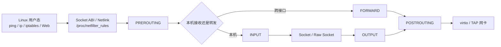

# Asterinas 网络扩展操作手册

本文说明如何在 VMware Ubuntu 环境中构建并运行本仓库，验证 Raw Socket、路由、Netfilter、iptables 风格规则、连接跟踪、IPv4/IPv6 转发、包过滤、MASQUERADE 和 DNAT，并启动本地 Web 仪表盘。

本文只描述运行与操作方法。测试日志、归档文件和临时故障材料不应与源码一同提交；需要保留证据时，应放在独立目录或发布附件中。

## 1. 功能概览

### Raw Socket 与路由

- IPv4 `AF_INET/SOCK_RAW`、ICMP 和通用 IP 协议收发。
- IPv6 Raw Socket 与 ICMPv6。
- `IP_HDRINCL`、TTL、TOS、错误队列、非阻塞和 poll/readiness。
- Netlink `RTM_GETROUTE` 路由查询。
- IPv6 NDP、以太网 ICMPv6 和双网卡转发。
- IPv4 数值地址和域名外网 Ping。域名首先在 Ubuntu 上解析为 IPv4 A 记录，再由 Guest 内 Raw Socket 发送 ICMP。

### Netfilter 与 iptables 风格控制

- `PREROUTING`、`INPUT`、`FORWARD`、`OUTPUT`、`POSTROUTING` 数据路径。
- filter/nat 表、链默认策略、顺序匹配、`ACCEPT` 和 `DROP`。
- IPv4 ICMP/TCP/UDP 及 IPv6/ICMPv6 匹配。
- 规则增加、插入、删除、检查、替换、清空、计数器清零和列表查询。
- `NEW`、`ESTABLISHED` 连接跟踪和返回方向识别。
- IPv4 ICMP/TCP/UDP 有状态 MASQUERADE、SNAT、DNAT。
- IPv6 有状态 MASQUERADE 与 DNAT。
- `/proc/netfilter_rules` 规则、策略、计数器和连接状态快照。
- 本地 Web 仪表盘中的自动演示、手动规则控制和 Raw Socket Ping。

## 2. 数据路径



包过滤决定数据包是否继续通过；连接跟踪保存双向流状态；DNAT 在路由选择前改写目标；SNAT 或 MASQUERADE 在发送前改写源地址，并在回包时执行反向映射。

## 3. 环境要求

- VMware 中运行的 Ubuntu x86-64。
- CPU 虚拟化已开启，VMware 允许嵌套虚拟化。
- Podman、KVM、QEMU。
- `iproute2`、`iputils-ping`、`tcpdump`、`python3`、`socat`、`curl`。
- Asterinas 构建镜像 `asterinas/asterinas:0.18.0-20260603`。

安装宿主机工具：

```bash
sudo apt-get update
sudo apt-get install -y \
  podman qemu-system-x86 iproute2 iputils-ping \
  tcpdump python3 socat curl
```

确认 KVM：

```bash
test -e /dev/kvm && ls -l /dev/kvm
```

## 4. 进入仓库并修正脚本权限

```bash
cd "$HOME/桌面/asterinas" || exit 1

chmod +x \
  tools/net/stage2-router-topology.sh \
  tools/net/netfilter-demo.sh \
  tools/net/netfilter-external-uplink.sh

git status --short
```

VMware 共享文件夹中的文件可能丢失 Unix 可执行位，因此每次从 Windows 复制新脚本后都应重新执行 `chmod +x`。

## 5. 启动构建容器

在 Ubuntu 仓库目录执行：

```bash
cd "$HOME/桌面/asterinas" || exit 1

sudo podman run --rm -it --privileged \
  --network=host \
  -v /dev:/dev \
  -v "$PWD:/root/asterinas" \
  -e HTTP_PROXY=http://192.168.255.1:7897 \
  -e HTTPS_PROXY=http://192.168.255.1:7897 \
  -e ALL_PROXY=http://192.168.255.1:7897 \
  -e RUSTUP_DIST_SERVER=https://rsproxy.cn \
  -e RUSTUP_UPDATE_ROOT=https://rsproxy.cn/rustup \
  docker.io/asterinas/asterinas:0.18.0-20260603
```

如果不使用代理，删除五个代理或镜像站点 `-e` 参数即可。

进入容器后确认路径：

```bash
cd /root/asterinas
test -f Makefile && echo "仓库路径正确"
```

## 6. 完整回归测试

在容器内执行：

```bash
cd /root/asterinas
set -o pipefail

AUTO_TEST=regression \
CONSOLE=ttyS0 \
LOG_LEVEL=error \
ENABLE_KVM=1 \
SMP=4 \
RELEASE=1 \
make run_kernel
```

成功标志：

```text
All test in /test/network passed.
All regression tests passed.
```

## 7. 创建双网卡隔离拓扑

在 Ubuntu 宿主机终端执行：

```bash
cd "$HOME/桌面/asterinas" || exit 1

sudo ./tools/net/stage2-router-topology.sh teardown 2>/dev/null || true
sudo ./tools/net/stage2-router-topology.sh setup
sudo ./tools/net/stage2-router-topology.sh show
```

拓扑地址：

| 对象 | IPv4 | IPv6 |
|---|---|---|
| 左端点 | `10.0.2.2` | `fd00:0:0:2::2` |
| Asterinas 左接口 | `10.0.2.15` | `fd00:0:0:2::15` |
| Asterinas 右接口 | `10.0.3.15` | `fd00:0:0:3::15` |
| 右端点 | `10.0.3.2` | `fd00:0:0:3::2` |

## 8. 启动指定网络功能

一次只启动一个 QEMU。验证下一项功能前，先退出当前 QEMU，再使用对应参数重新启动。

容器内通用命令：

```bash
cd /root/asterinas

NETDEV=router-tap \
ROUTER_TAP0=as2tap0 \
ROUTER_TAP1=as2tap1 \
CONSOLE=ttyS0 \
LOG_LEVEL=error \
ENABLE_KVM=1 \
SMP=4 \
RELEASE=1 \
EXTRA_KCMD_ARGS='--kcmd-args="在此填写功能参数"' \
make run_kernel
```

功能参数：

| 功能 | 参数 |
|---|---|
| IPv4 转发 | `netfilter.ipv4_forward=on` |
| IPv4 与 IPv6 转发 | `netfilter.ipv4_forward=on netfilter.ipv6_forward=on` |
| ICMP MASQUERADE | `netfilter.ipv4_forward=on netfilter.stage3_icmp_masquerade=on` |
| ICMP DNAT | `netfilter.ipv4_forward=on netfilter.stage3_icmp_dnat=on` |
| ICMP FORWARD DROP | `netfilter.ipv4_forward=on netfilter.stage3_icmp_forward_drop=on` |
| TCP MASQUERADE | `netfilter.ipv4_forward=on netfilter.stage4_tcp_masquerade=on` |
| UDP MASQUERADE | `netfilter.ipv4_forward=on netfilter.stage4_udp_masquerade=on` |
| TCP DNAT | `netfilter.ipv4_forward=on netfilter.stage4_tcp_dnat=on` |
| TCP 连接跟踪策略 | `netfilter.ipv4_forward=on netfilter.stage4_tcp_masquerade=on netfilter.stage6_tcp_conntrack_policy=on` |
| IPv6 FORWARD DROP | `netfilter.ipv6_forward=on netfilter.stage11_ipv6_forward_drop=on` |
| IPv6 MASQUERADE | `netfilter.ipv6_forward=on netfilter.stage12_ipv6_snat=on` |
| IPv6 DNAT | `netfilter.ipv6_forward=on netfilter.stage12_ipv6_dnat=on` |

## 9. 宿主机功能测试命令

QEMU 保持运行，在另一个 Ubuntu 终端执行对应命令。不要把所有命令连续用于同一个 Guest。

```bash
cd "$HOME/桌面/asterinas" || exit 1

# 基础转发与 IPv6 邻居发现
sudo ./tools/net/stage2-router-topology.sh test
sudo ./tools/net/stage2-router-topology.sh test-ipv6
sudo ./tools/net/stage2-router-topology.sh test-ipv6-forward

# IPv4 ICMP 过滤与 NAT
sudo ./tools/net/stage2-router-topology.sh test-nat
sudo ./tools/net/stage2-router-topology.sh test-dnat
sudo ./tools/net/stage2-router-topology.sh test-forward-drop

# TCP/UDP NAT
sudo ./tools/net/stage2-router-topology.sh test-tcp-nat
sudo ./tools/net/stage2-router-topology.sh test-udp-nat
sudo ./tools/net/stage2-router-topology.sh test-tcp-dnat

# IPv6 过滤与 NAT
sudo ./tools/net/stage2-router-topology.sh test-ipv6-forward-drop
sudo ./tools/net/stage2-router-topology.sh test-ipv6-snat
sudo ./tools/net/stage2-router-topology.sh test-ipv6-dnat
```

## 10. Guest 内手动规则控制

进入 Guest Shell 后查看完整规则快照：

```bash
cat /proc/netfilter_rules
```

典型过滤规则：

```bash
./iptables -F OUTPUT
./iptables -P OUTPUT ACCEPT
./iptables -A OUTPUT -p icmp --icmp-type echo-request -j DROP
./iptables -I OUTPUT 1 -p icmp --icmp-type echo-request -j ACCEPT
./iptables -C OUTPUT -p icmp --icmp-type echo-request -j DROP
./iptables -R OUTPUT 1 -p icmp --icmp-type echo-request -j ACCEPT
./iptables -Z OUTPUT
./iptables -D OUTPUT 1
./iptables -L OUTPUT
```

连接跟踪规则：

```bash
./iptables -P FORWARD DROP
./iptables -A FORWARD -p tcp --dport 9000 \
  -m conntrack --ctstate NEW -j ACCEPT
./iptables -A FORWARD -p tcp \
  -m conntrack --ctstate ESTABLISHED -j ACCEPT
```

NAT 规则：

```bash
./iptables -t nat -F
./iptables -t nat -A POSTROUTING -j MASQUERADE
./iptables -t nat -A POSTROUTING -p tcp --dport 8080 \
  -j SNAT --to-source 10.0.2.15:40000
./iptables -t nat -A PREROUTING -p udp --dport 5353 \
  -j DNAT --to-destination 10.0.3.2:5354
./iptables -t nat -L
```

## 11. Web 仪表盘

仪表盘需要双网卡拓扑、交互式 Guest 和本地 Web 服务同时运行。

### 11.1 启动交互式 Guest

容器内执行：

```bash
cd /root/asterinas
mkdir -p runtime/netfilter-demo

NETDEV=router-tap \
ROUTER_TAP0=as2tap0 \
ROUTER_TAP1=as2tap1 \
AUTO_TEST=demo-step \
CONSOLE=ttyS0 \
LOG_LEVEL=error \
ENABLE_KVM=1 \
SMP=4 \
RELEASE=1 \
NETFILTER_DEMO_SOCKET=runtime/netfilter-demo/control.sock \
NETFILTER_DEMO_SERIAL_LOG=runtime/netfilter-demo/serial.log \
EXTRA_KCMD_ARGS='--kcmd-args="netfilter.ipv4_forward=on netfilter.ipv6_forward=on"' \
make run_kernel
```

### 11.2 启动 Web 服务

Ubuntu 宿主机另开终端：

```bash
cd "$HOME/桌面/asterinas" || exit 1

NETFILTER_DEMO_DIR="$PWD/runtime/netfilter-demo" \
NETFILTER_DEMO_LOG="$PWD/runtime/netfilter-demo/serial.log" \
NETFILTER_DEMO_SOCKET="$PWD/runtime/netfilter-demo/control.sock" \
bash tools/net/netfilter-demo.sh serve
```

浏览器访问：

```text
http://127.0.0.1:8080/
```

服务启动后，先在宿主机确认 Web 服务与 Guest 串口均已连接；返回的 JSON 中应包含 `"connected": true`。在该条件满足前不要点击操作按钮。

```bash
curl -sS http://127.0.0.1:8080/api/state | python3 -m json.tool | sed -n '1,35p'
```

### 11.3 仪表盘操作区

- **Next step**：执行自动演示的下一个操作。
- **Reset**：清理演示规则并恢复默认策略。
- **Run scenario**：连续运行过滤、连接跟踪或 NAT 场景。
- **Refresh snapshot**：重新读取 `/proc/netfilter_rules`。
- **Manual iptables/ip6tables**：手工输入规则参数，实现增删改查、策略修改和计数器操作。
- **Ping in guest**：在 Guest 内通过 IPv4 Raw Socket 发起 Ping。
- **Run local IPv4**：验证隔离拓扑目标。
- **Run external IPv4**：验证外网目标。

## 12. IPv4 外网与域名 Ping

首先确认 Ubuntu 本身存在 IPv4 默认路由：

```bash
ip -4 route show default
ping -4 -c 2 1.1.1.1
```

建立可逆上联网关：

```bash
cd "$HOME/桌面/asterinas" || exit 1

sudo bash tools/net/netfilter-external-uplink.sh teardown 2>/dev/null || true
sudo bash tools/net/netfilter-external-uplink.sh setup
sudo bash tools/net/netfilter-external-uplink.sh status
sudo bash tools/net/netfilter-external-uplink.sh test-ipv4
```

然后在仪表盘输入：

```text
1.1.1.1
baidu.com
qq.com
```

域名由 Ubuntu 解析为 IPv4 A 记录；仪表盘只向 Guest 传递数值 IPv4 地址，因此仍然实际经过 Guest Raw Socket、路由、OUTPUT、转发和回包队列。

结束演示后清理临时上行配置：

```bash
sudo bash tools/net/netfilter-external-uplink.sh teardown
```

## 13. 常见故障

### TCP MASQUERADE 首次连接超时

先确认只有一个 QEMU 使用 `as2tap0/as2tap1`：

```bash
pgrep -af qemu-system-x86_64
```

如果存在旧进程，正常退出旧 QEMU 后重新创建拓扑。测试脚本会先预热邻居路径并等待右端 TCP 服务进入监听状态，避免在嵌套虚拟化环境中首个 SYN 因初始化时序而超时。

### IPv6 DNAT 无法命中

文本地址 `fd00:0:0:3::15` 的最后一段是十六进制 `0x15`。确认规则常量没有被写成十进制 15：

```bash
grep -n '0x15' kernel/src/net/router.rs
```

Guest 启动后应看到 IPv6 DNAT 规则安装信息，再执行 `test-ipv6-dnat`。

### 仪表盘外网 Ping 全部失败

检查上联脚本权限和上行状态：

```bash
chmod +x tools/net/netfilter-demo.sh tools/net/netfilter-external-uplink.sh
sudo bash tools/net/netfilter-external-uplink.sh status
sudo bash tools/net/netfilter-external-uplink.sh test-ipv4
```

如果宿主机上联测试失败，先不要在仪表盘重复 Ping。只有 Ubuntu 的默认路由、转发和 MASQUERADE 均有效后，Guest 外网 Ping 才能成功。

### 仪表盘按钮显示 QEMU socket 未连接

```bash
ls -l runtime/netfilter-demo/control.sock
curl -sS http://127.0.0.1:8080/api/state | python3 -m json.tool
```

确认 QEMU 和 Web 服务使用完全相同的 `NETFILTER_DEMO_SOCKET` 与 `NETFILTER_DEMO_SERIAL_LOG`。

## 14. 清理环境

```bash
cd "$HOME/桌面/asterinas" || exit 1

sudo bash tools/net/netfilter-external-uplink.sh teardown 2>/dev/null || true
sudo ./tools/net/stage2-router-topology.sh teardown 2>/dev/null || true
```

清理命令只删除本项目创建的 namespace、veth、TAP、专用 iptables 链和临时路由，并恢复修改前的转发设置。

## 15. 关键代码位置

| 路径 | 作用 |
|---|---|
| `kernel/libs/aster-bigtcp/src/netfilter/` | Hook、规则、链、计数器、conntrack 和 NAT |
| `kernel/libs/aster-bigtcp/src/forwarding.rs` | IPv4/IPv6 转发、TTL/Hop Limit 与地址改写 |
| `kernel/libs/aster-bigtcp/src/iface/poll.rs` | ingress/egress 调度及 Hook 调用 |
| `kernel/libs/aster-bigtcp/src/iface/phy/ether.rs` | Ethernet 与 IPv6 NDP |
| `kernel/src/fs/fs_impls/procfs/netfilter_rules.rs` | `/proc/netfilter_rules` 和规则命令解析 |
| `kernel/src/net/router.rs` | 转发开关及验收规则安装 |
| `kernel/src/net/socket/ip/raw.rs` | IPv4 Raw Socket Linux ABI |
| `kernel/src/net/socket/ip/raw_v6.rs` | IPv6 Raw Socket Linux ABI |
| `kernel/libs/aster-bigtcp/src/socket/raw_ip.rs` | Raw 数据包队列和底层收发 |
| `kernel/src/net/socket/netlink/route/` | `RTM_GETROUTE` 与路由消息 |
| `tools/net/stage2-router-topology.sh` | namespace、bridge、TAP 与端到端测试 |
| `tools/net/netfilter-external-uplink.sh` | 可逆 IPv4 上联网关 |
| `tools/net/netfilter-control-dashboard.py` | Web 仪表盘与控制 API |

## 16. 一次性复现与保存最终验证输出

仓库根目录的 `collect-final-logs.sh` 将拓扑准备、Guest 启动、定向网络测试、仪表盘探针、外部 IPv4 连通与归档组合为可重复命令。脚本保存运行输出，但不会自动将输出加入 Git 提交。

```bash
cd "$HOME/桌面/asterinas" || exit 1
chmod +x collect-final-logs.sh

# 使用独立目录保存本轮结果
export ASTERINAS_FINAL_LOGS="$PWD/final-logs-$(date +%Y%m%d-%H%M%S)"

# 清理旧网络资源并创建干净拓扑
./collect-final-logs.sh prepare

# 在容器中完成完整回归；结束后退出 QEMU 回到宿主机终端
./collect-final-logs.sh regression

# 以下每项均要求对应功能参数的 Guest 正在运行
./collect-final-logs.sh test tcp-masquerade
./collect-final-logs.sh test ipv6-dnat

# 交互式 Guest 与 Web 服务运行后，记录 Raw Socket、规则与仪表盘探针
./collect-final-logs.sh dashboard-probes

# 建立可撤销 IPv4 上联网关并记录数值地址和域名 Ping
./collect-final-logs.sh external-setup

# 生成压缩归档与 SHA-256 文件
./collect-final-logs.sh archive
```

如果只需要收集特定场景，可使用 `./collect-final-logs.sh test <名称>`。所有验证结束后，可使用下面命令清理临时网络资源：

```bash
sudo bash tools/net/netfilter-external-uplink.sh teardown 2>/dev/null || true
sudo ./tools/net/stage2-router-topology.sh teardown 2>/dev/null || true
```
